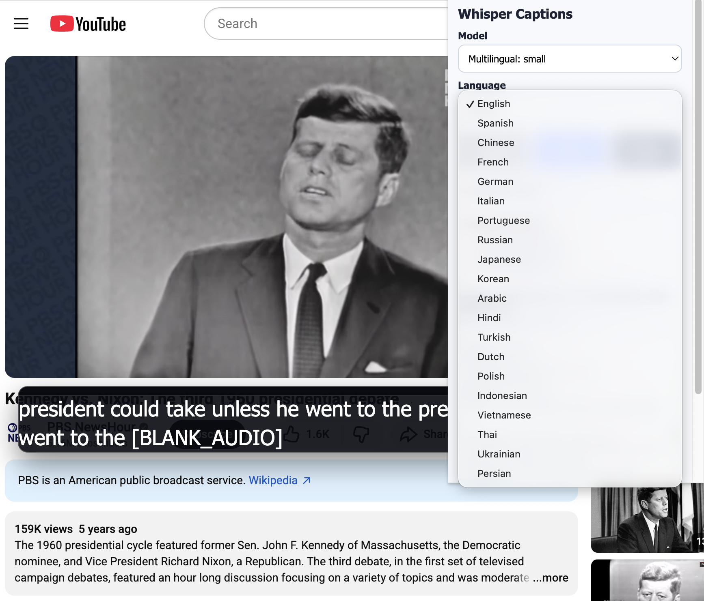

# Local Whisper Captions (Chrome Extension)

Chrome extension that:

- Captures **tab audio** (not microphone)
- Runs **Whisper locally in-browser** via `@xenova/transformers`
- Injects an overlay subtitle UI into the active page

## 1) Install dependencies

```bash
npm install
```

## 2) Build extension

```bash
npm run build
```

This generates `dist/`.

## 3) Load in Chrome

1. Open `chrome://extensions`
2. Enable **Developer mode**
3. Click **Load unpacked**
4. Select the `dist/` folder

## 4) Use

1. Open a normal web page tab with audio/video
2. Click the extension icon
3. Choose model/language
4. Click **Load model** (one-time per selected model)
5. After status shows model ready, click **Start**
6. Subtitles appear as an overlay in that tab
7. Click **Stop** to end capture

## Notes

- First model load can take from a few seconds to over a minute depending on model, network, and hardware.
- After loading once, the model stays warm for the extension session and subsequent starts are much faster.
- First run downloads model weights from Hugging Face, then reuses browser cache.
- Some restricted pages (`chrome://*`, Chrome Web Store, some extension pages) do not allow script injection.
- `whisper-tiny.en` is fastest; `whisper-base.en` is slower but usually more accurate.
